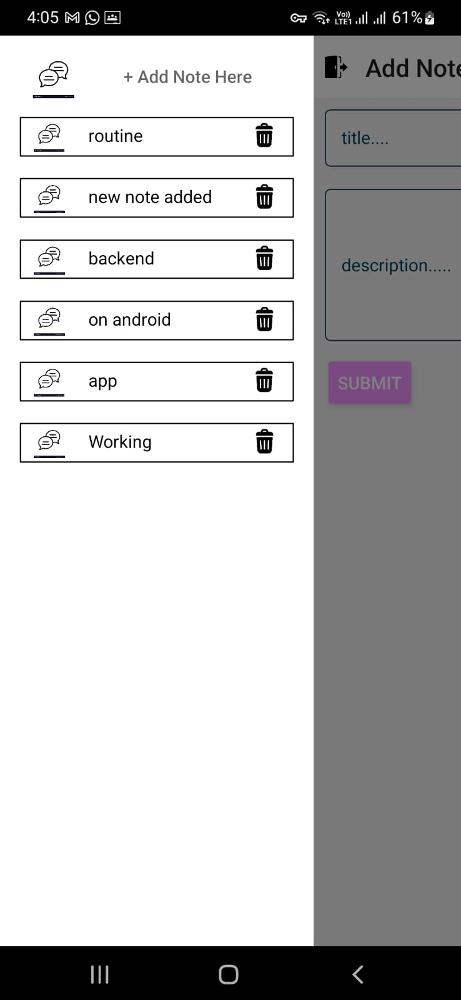
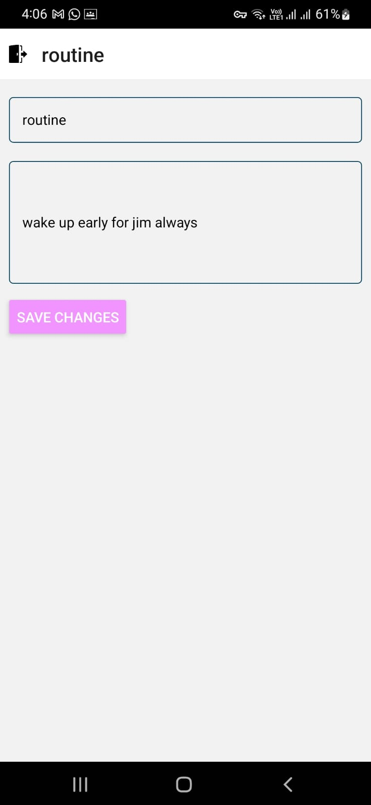
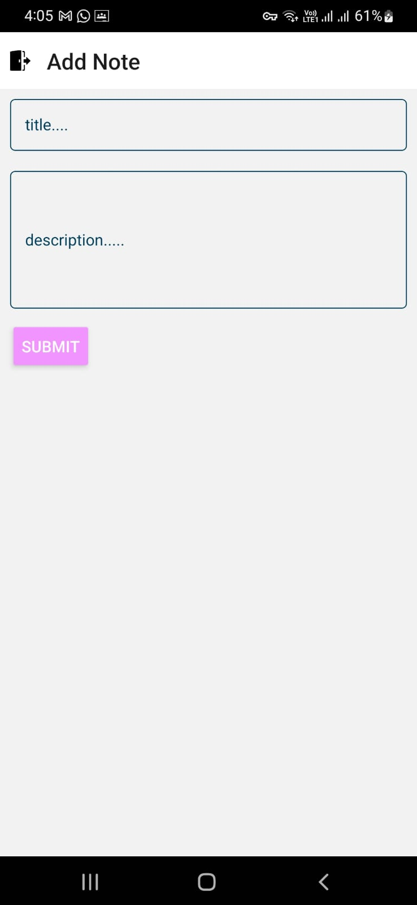

# It is a app like chat_gpt 
<p> Here you can add your notes and when you open the drawar from left side you will see your added not here and that note will have own screen where user can edit that note and see the note anytime. User can also delete the note </p>

### Further development will be
<p>Now next I will try to give it ability that you can add note by directly speaking on app using NLP...</p>

## Technology used
<ul>
   <li> React-Native for frontend development </li>
   <li> NodeJs for backend development of the app </li>
</ul>
# Getting Started

>**Note**: Make sure you have completed the [React Native - Environment Setup](https://reactnative.dev/docs/environment-setup) instructions till "Creating a new application" step, before proceeding.

## before start
<p> Before start you need to download some dependencies which you can see on package.json and to download just write <bold> npm install dependency_name </bold> </p>

## Step 1: Start the Metro Server

First, you will need to start **Metro**, the JavaScript _bundler_ that ships _with_ React Native.

To start Metro, run the following command from the _root_ of your React Native project:

```bash
# using npm
npm start

# OR using Yarn
yarn start
```

## Step 2: Start your Application

Let Metro Bundler run in its _own_ terminal. Open a _new_ terminal from the _root_ of your React Native project. Run the following command to start your _Android_ or _iOS_ app:

### For Android

```bash
# using npm
npm run android

# OR using Yarn
yarn android
```

### For iOS

```bash
# using npm
npm run ios

# OR using Yarn
yarn ios
```

If everything is set up _correctly_, you should see your new app running in your _Android Emulator_ or _iOS Simulator_ shortly provided you have set up your emulator/simulator correctly.

This is one way to run your app — you can also run it directly from within Android Studio and Xcode respectively.

<div>
   
   
   
</div>

